# Module Federation 架构图表集

> 以下图表使用 Mermaid 格式，可在 GitHub、GitLab 或任何支持 Mermaid 的 Markdown 渲染器中查看。

---

## 1. 核心概念关系图

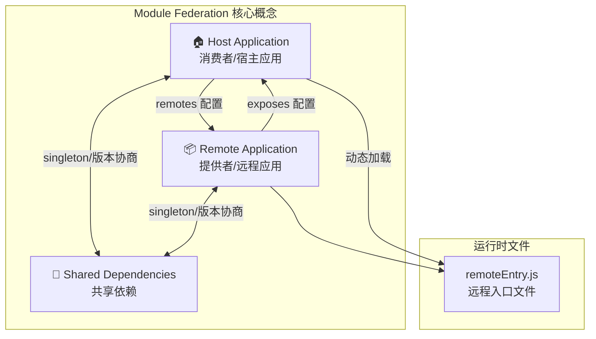

---

## 2. 应用角色与关系

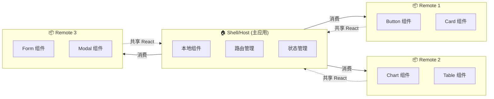

---

## 3. 双向联邦架构

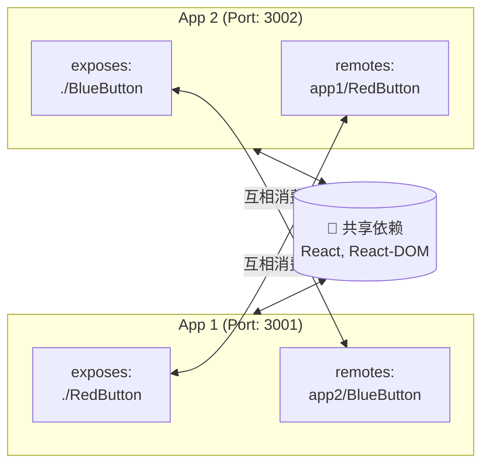

---

## 4. 嵌套远程加载

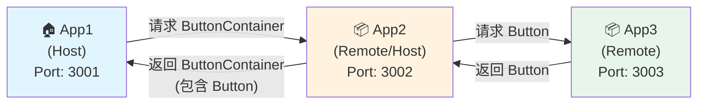

---

## 5. 运行时加载流程

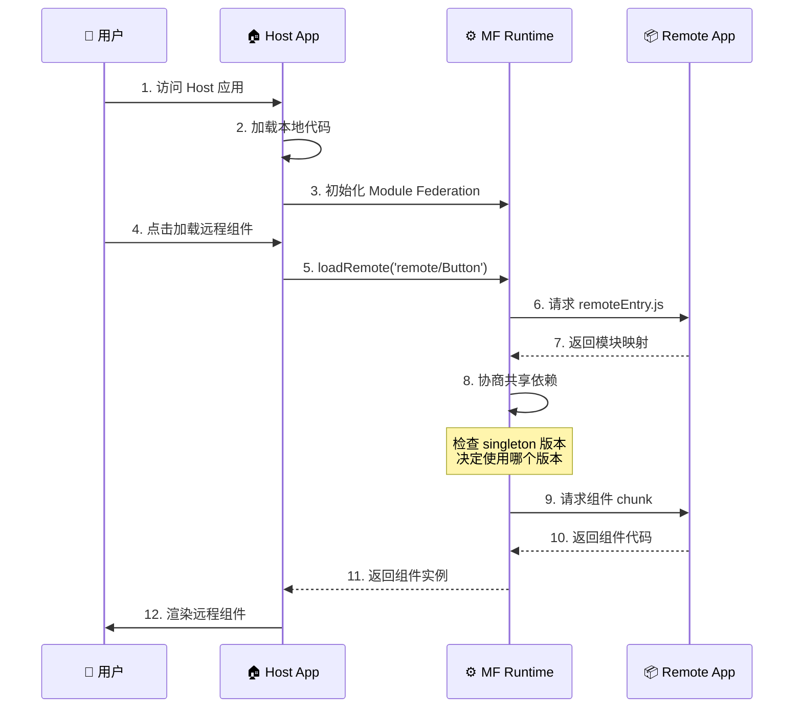

---

## 6. 共享依赖协商流程

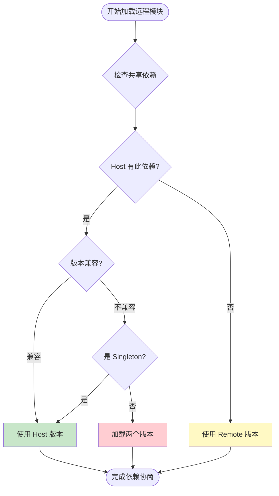

---

## 7. SSR 架构

```mermaid
flowchart TB
    subgraph Client["🌐 客户端"]
        Browser[浏览器]
        ClientBundle[Client Bundle]
    end
    
    subgraph Server["🖥️ 服务端"]
        NodeServer[Node.js Server]
        ServerBundle[Server Bundle]
        SSR[SSR Middleware]
    end
    
    subgraph Remote1["📦 Remote 1"]
        R1Client[/client/remoteEntry.js]
        R1Server[/server/remoteEntry.js]
    end
    
    subgraph Remote2["📦 Remote 2"]
        R2Client[/client/remoteEntry.js]
        R2Server[/server/remoteEntry.js]
    end
    
    Browser -->|"Hydration"| ClientBundle
    ClientBundle -->|"加载"| R1Client
    ClientBundle -->|"加载"| R2Client
    
    NodeServer --> SSR
    SSR -->|"UniversalFederation"| ServerBundle
    ServerBundle -->|"加载"| R1Server
    ServerBundle -->|"加载"| R2Server
    
    SSR -->|"返回 HTML"| Browser
```

---

## 8. 跨框架状态共享

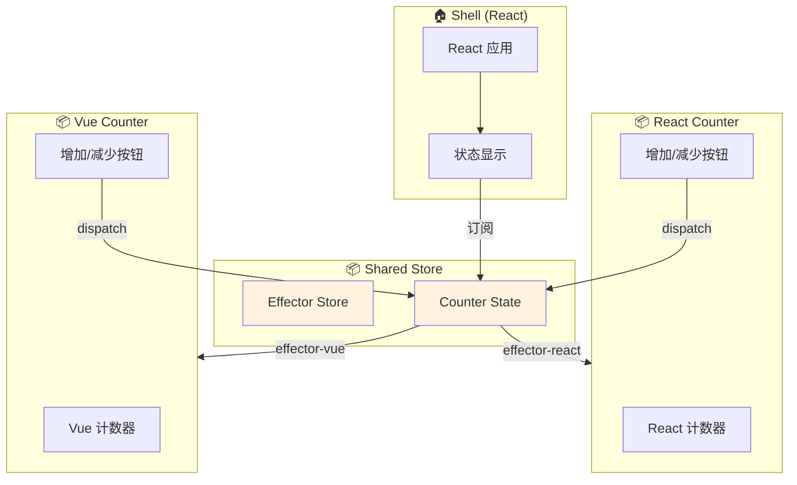

---

## 9. 动态远程加载

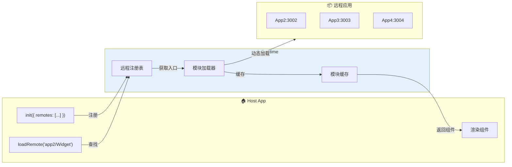

---

## 10. 项目结构总览

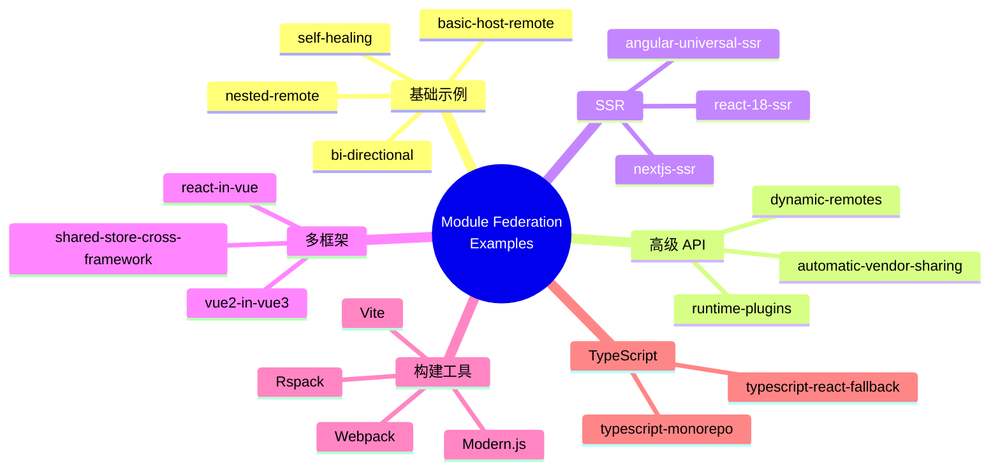

---

## 11. 实现步骤流程

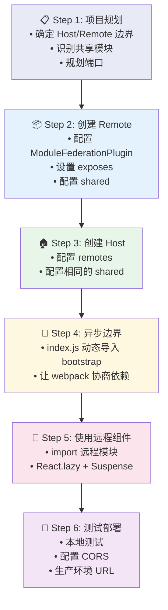

---

## 12. 错误处理流程

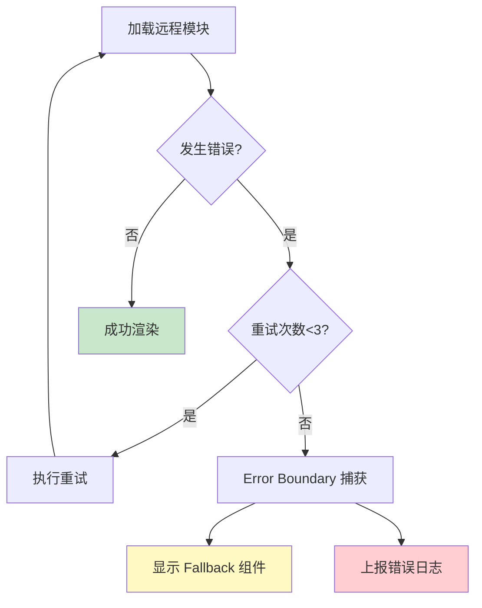

---

## 使用说明

这些图表可以在以下平台正确渲染：
- GitHub (README.md, Issues, PR)
- GitLab
- VS Code (Mermaid 插件)
- Notion
- Typora
- 各种支持 Mermaid 的在线编辑器

如需导出为图片，可以使用：
- [Mermaid Live Editor](https://mermaid.live/)
- VS Code Mermaid 插件导出功能
- `mmdc` CLI 工具
